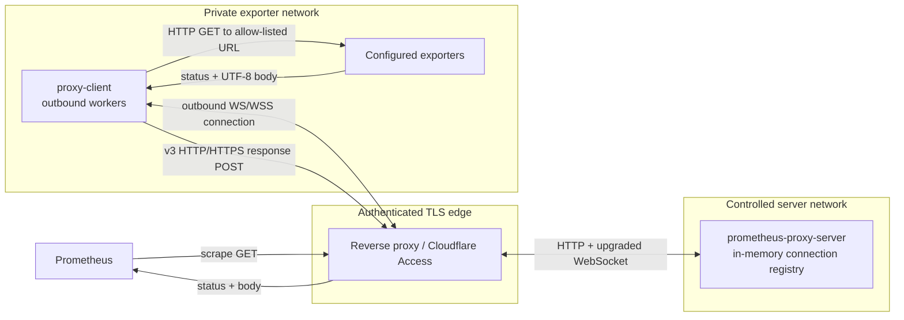
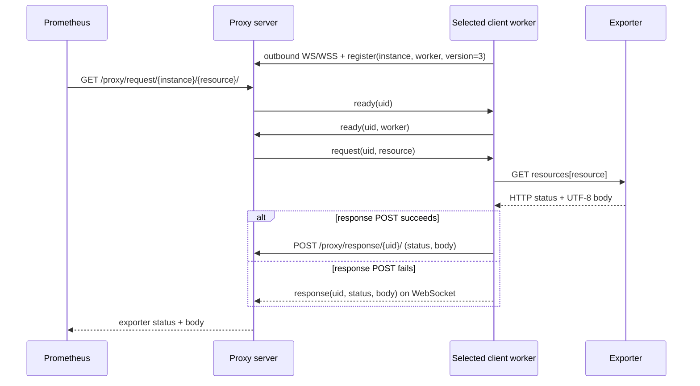

# Prometheus WebSocket Proxy Server

[](https://github.com/razortheory/prometheus-ws-proxy-server/actions/workflows/ci.yml)

`prometheus-proxy-server` is the public-side gateway for scraping Prometheus
exporters in private networks. Proxy clients establish outbound WebSocket
connections; the server dispatches ordinary Prometheus HTTP requests over those
connections and returns the exporter status and body.

The matching private-side agent is
[prometheus-ws-proxy-client](https://github.com/razortheory/prometheus-ws-proxy-client).

## Why this exists

Prometheus normally needs an inbound path to every exporter. This pair reverses
that connection: clients dial out from exporter networks, while Prometheus uses
one stable HTTP endpoint. Exporter addresses remain in client configuration and
are never accepted from public request parameters.

## Architecture and trust boundaries



The edge is a required trust boundary, not part of this binary. The server
listens with plain HTTP/WebSocket, performs no authentication, and enables
permissive CORS. Only an authenticated reverse proxy and trusted proxy clients
should be able to reach it.

## Wire-v3 scrape flow

The sequence below treats the edge and backend as one logical proxy endpoint;
the architecture diagram above shows the physical hop between them.



For wire versions 2 and 3, up to 1,024 idle workers for the requested instance
are offered the UID and the first valid `ready` reply is selected. One worker
handles one scrape at a time. Response headers are not transported.

## Wire compatibility

Product version and wire version are separate. The v3 server accepts all three
historical wire modes so server and client migrations can be staged.

| Wire version | Worker selection | Response transport |
| --- | --- | --- |
| `1` | Server dispatches directly | WebSocket |
| `2` | `ready` handshake selects an idle worker | WebSocket |
| `3` | `ready` handshake selects an idle worker | HTTP form POST, with WebSocket fallback in the Rust client |

Both JSON heartbeat messages and RFC 6455 control ping/pong frames are handled.
Every route accepts forms with and without a trailing slash.

## Install a release

Releases contain a stripped, static Linux amd64 binary and a checksum:

```bash
VERSION=v3.0.0
BASE="https://github.com/razortheory/prometheus-ws-proxy-server/releases/download/${VERSION}"

curl -fLO "${BASE}/prometheus-proxy-server-linux-amd64"
curl -fLO "${BASE}/prometheus-proxy-server-linux-amd64.sha256"
sha256sum --check prometheus-proxy-server-linux-amd64.sha256
sudo install -m 0755 prometheus-proxy-server-linux-amd64 \
  /usr/local/bin/prometheus-proxy-server
prometheus-proxy-server --version
```

The release binary uses musl and rustls; it does not depend on glibc or OpenSSL
at runtime. Install a current CA certificate store if Sentry reporting uses an
HTTPS DSN.

## Configuration

Pass a JSON file as the positional argument. The committed
[`example.config.json`](./example.config.json) contains:

```json
{
  "redis": {
    "host": "localhost",
    "port": 6379,
    "db": 0
  },
  "url_prefix": "proxy",
  "host": "0.0.0.0",
  "port": 8081
}
```

All fields are required; the Serde configuration defines no defaults.

| Field | Type | Meaning |
| --- | --- | --- |
| `host` | IP address string | Listen address. It must parse as an IPv4 or IPv6 address; hostnames are not accepted. |
| `port` | unsigned 16-bit integer | Listen port. |
| `url_prefix` | string | Prefix for every route. Surrounding slashes are trimmed; an empty string serves routes from `/`. |
| `redis.host` | string | Required legacy compatibility field; parsed but unused. |
| `redis.port` | unsigned 16-bit integer | Required legacy compatibility field; parsed but unused. |
| `redis.db` | unsigned 16-bit integer | Required legacy compatibility field; parsed but unused. |

The server does not connect to Redis. Client registrations, worker state, and
pending requests all live in process-local memory. Request concurrency and
message sizes are bounded, but the number of connected workers is not.

## Run

```text
prometheus-proxy-server [OPTIONS] [CONFIG]
```

```bash
prometheus-proxy-server ./example.config.json -v
curl -fsS http://127.0.0.1:8081/proxy/health/
```

The committed example listens on all interfaces. Change `host` to `127.0.0.1`
when the server should be reachable only through a local reverse proxy.

| Option | Default | Notes |
| --- | --- | --- |
| `CONFIG` | `client_config.json` | JSON configuration path. The historical filename is retained; pass an explicit server path in production. |
| `-v`, `--verbose` | none | Zero or one occurrence uses `info`, two use `debug`, and three or more use `trace`. |
| `--sentry_dsn <DSN>` | unset | Enable Sentry error reporting. The underscore spelling is intentional for compatibility. |

`RUST_LOG` overrides the verbosity-derived filter. SIGINT and SIGTERM start
graceful shutdown; the process allows a shared 15-second shutdown window before
forcing exit.

## HTTP and WebSocket API

With `url_prefix: "proxy"`:

| Method | Route | Purpose |
| --- | --- | --- |
| `GET` | `/proxy/health/` | Process liveness check; always returns `200 OK` and does not check client readiness. |
| `GET` upgrade | `/proxy/ws/` | Client registration, heartbeat, request, and WebSocket response traffic. |
| `GET` | `/proxy/request/{instance}/{resource}/` | Prometheus scrape endpoint. |
| `POST` form | `/proxy/response/{uid}/` | Wire-v3 response endpoint with `status` and `body` form fields. |

The public Prometheus target shape is:

```text
https://prometheus.example.com/proxy/request/host-a/node/
```

The scrape route forwards only the `resource` key. Prometheus query parameters,
request headers, and request bodies are not passed to the exporter. The server
returns the proxied status and UTF-8 body but not exporter response headers or
the original content type.

## Reverse proxy

All four routes, including the response POST, must reach the same server process.
A minimal Nginx location for the example port is:

```nginx
location /proxy/ {
    proxy_pass http://127.0.0.1:8081;
    proxy_http_version 1.1;
    proxy_set_header Upgrade $http_upgrade;
    proxy_set_header Connection "upgrade";
    proxy_read_timeout 60s;
}
```

Terminate TLS and enforce authentication at this layer. If Cloudflare Access is
used, configure the matching client service token in the client repository's
JSON configuration.

## Security model

- Do not expose the backend listener directly to the internet. There is no
  server-side authentication for WebSocket registration, scrape routes, or
  response UIDs.
- Restrict the reverse proxy so only the intended Prometheus and authenticated
  clients can reach the relevant routes. Permissive CORS is not access control.
- Treat registered instance and worker identities as claims made by the admitted
  client connection; the server does not consult an external identity store. A
  new connection claiming the same instance and worker replaces the old one.
- Treat a pending response UID as a bearer capability. WebSocket responses are
  tied to the selected worker, but the form POST endpoint accepts a matching UID
  without independently authenticating that worker.
- Keep the backend on loopback or a controlled private interface whenever the
  edge runs on the same host or network.
- The server never receives exporter URLs. The companion client's `resources`
  map is the boundary that decides which local endpoints can be called.

## Operational behavior and limits

| Behavior | Bound |
| --- | --- |
| Globally admitted scrape requests | 1,024 |
| Worker selection candidates per request | up to 1,024 |
| Active scrapes per worker | one |
| Per-worker outbound queue | 8 messages |
| HTTP form body, WebSocket frame, and WebSocket message | 64 MiB |
| Ready-selection timeout | 30 seconds |
| Exporter-response timeout after dispatch | 30 seconds |
| WebSocket heartbeat | every 15 seconds; stale after 45 seconds without activity |
| WebSocket send timeout | 5 seconds |

Capacity is admitted with a non-blocking semaphore. Exhaustion fails fast rather
than creating an unbounded request queue. Disconnected worker generations,
completed or timed-out UIDs, and empty instance maps are removed from memory.
Connected-worker count itself has no configured ceiling.

Prometheus-facing failure behavior:

| Condition | Response |
| --- | --- |
| No registered client for `instance` | `404` with `no such client` |
| Instance exists but no worker is available | `503` |
| Global capacity is exhausted | `503` |
| No ready worker responds within 30 seconds | `503` |
| Selected worker disconnects or its queue cannot accept the request | `503` |
| Client response does not arrive within 30 seconds | `501` |
| Valid client response | Client-provided status and body |

Wire-v3 delivery is transport-level at-least-once: a client may retry a response
over WebSocket after an ambiguous POST result. A pending UID is consumed once,
so duplicate delivery cannot complete the same scrape twice.

For legacy wire behavior, the form endpoint returns `200 OK` even when its UID
is no longer pending. An invalid form `status` value returns `400 Bad Request`.

## Single-process deployment

WebSocket ownership and pending UIDs exist only in the process that accepted the
connection. There is no shared Redis-backed registry. Run one active server for
a public route; ordinary round-robin load balancing across replicas can send a
scrape or response to a process that does not own the client connection.

For availability, keep a previous server ready as a controlled upstream
rollback target instead of placing both processes behind the active route.

## Development

The repository pins Rust `1.96.0`; `Cargo.toml` declares Rust `1.88` as the
minimum supported version. Cargo is configured to use `sccache`, so install
`sccache` `0.16.0` and keep it on `PATH`.

```bash
cargo +1.96.0 fmt --all -- --check
cargo +1.96.0 check --locked --all-targets --all-features
cargo +1.96.0 test --locked --all-targets --all-features
cargo +1.96.0 clippy --locked --all-targets --all-features -- -D warnings
cargo +1.88.0 check --locked --all-targets --all-features
cargo +1.88.0 test --locked --all-targets --all-features
```

Run directly from the checkout:

```bash
cargo +1.96.0 run --locked -- ./example.config.json -v
```

The tests exercise route compatibility, all wire modes, heartbeat handling,
worker replacement and disconnect races, concurrency admission, timeouts,
cleanup, duplicate delivery, and graceful shutdown behavior.

## Build the Linux artifact with Docker

The Dockerfile produces an artifact stage, not a runtime image:

```bash
docker buildx build \
  --platform linux/amd64 \
  --target artifact \
  --output type=local,dest=dist \
  .

./dist/prometheus-proxy-server-linux-amd64 --version
```

The builder downloads the pinned `sccache` release with checksum verification.
CI additionally passes optional GitHub Actions cache credentials as BuildKit
secrets.

## CI and releases

GitHub Actions checks formatting, tests, Clippy with warnings denied, Rust 1.88
MSRV, and the static Linux amd64 artifact. CI smoke-tests the artifact in an
Ubuntu 16.04 container. A `v*` tag must exactly match the Cargo package version;
the release workflow then runs the same artifact in Ubuntu 16.04, 18.04, 20.04,
22.04, 24.04, and 26.04 userspaces before publishing it and its SHA-256 file.

Those container checks validate userspace compatibility on the runner's kernel.
They are not proof that the binary runs on each distribution's historical
kernel, so Ubuntu 16 support remains provisional until verified on a real host
or VM.

## Related repository

- [prometheus-ws-proxy-client](https://github.com/razortheory/prometheus-ws-proxy-client) — maintains outbound worker connections and calls allow-listed exporters.

## License

No license file is currently included in this repository.
